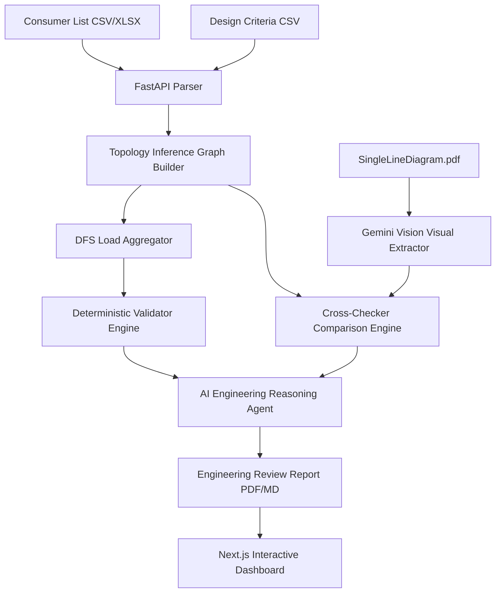

# SingleLineIQ ⚡

### **Agentic Electrical Single-Line Reviewer**
*Automated review, topology validation, visual diagram cross-checking, and AI-powered design auditing for industrial electrical distribution networks.*

---

## 📋 Project Overview

**SingleLineIQ** is a pair-programming capstone project designed to audit industrial power distribution layouts. It acts as an automated design verification agent that bridges the gap between engineering schedules and visual electrical single-line diagrams (SLDs). 

By ingesting tabular consumer lists and design criteria files, SingleLineIQ builds a network topology graph, computes downstream connected loads, runs rigorous deterministic checks, and performs an independent visual cross-check against the electrical CAD single-line drawing PDF using Google Gemini vision model APIs.

> [!IMPORTANT]
> **Synthetic Data Disclaimer**: All data, single-line diagrams, and reports included in this repository are strictly synthetic and anonymized. This project is for demonstration purposes and is not based on any real plant, client, project, or confidential engineering deliverable.

---

## 🏗️ Architecture Pipeline

The diagram below outlines how data flows through the backend parsing, loading, checking, cross-checking, and AI reasoning modules:



## 🤖 Agentic Architecture

SingleLineIQ uses a multi-agent orchestration layer around deterministic engineering tools:

| Agent | Responsibility | Tool Boundary |
| :--- | :--- | :--- |
| `singleline_review_orchestrator` | Coordinates the end-to-end review and records the trace. | Calls the specialized agents in sequence. |
| `intake_agent` | Reads and normalizes user deliverables. | `parse_consumer_list`, `parse_design_criteria` |
| `topology_agent` | Infers the hierarchy from structured tags. | `build_topology` |
| `calculation_agent` | Computes loads and deterministic findings. | `calculate_loads`, `validate` |
| `sld_review_agent` | Performs visual SLD extraction/cross-checking. | `extract_sld_assets`, `cross_check_sld` |
| `reasoning_agent` | Explains evidence-backed issues. | Gemini when enabled, deterministic templates otherwise. |
| `report_review_agent` | Reviews/polishes the final report. | Gemini when enabled, bounded fallback otherwise. |

The API exposes the architecture at `/api/agent/architecture`, and analysis responses include an `agent_trace`.

Safety boundaries are intentionally strict: the consumer list is the structured source of truth, the SLD PDF is only a visual cross-check, Python calculations own numerical checks, and Gemini must not invent equipment tags, ratings, voltages, hierarchy, or issue IDs.

---

## ⚙️ Environment Variables

Copy `.env.example` in the root directory to `.env` to configure settings:

| Variable | Description | Default / Example |
| :--- | :--- | :--- |
| `APP_NAME` | Name of the application. | `SingleLineIQ` |
| `USE_GEMINI` | Toggle to enable Google Gemini AI Vision extraction and summarization. | `false` |
| `GOOGLE_API_KEY` | Google Vertex AI or Gemini API Credential key. | `(Empty by default)` |
| `USE_DEMO_SLD_EXTRACT` | Toggle to use the cached visual extract when Gemini is disabled. | `true` |
| `DATA_DIR` | Relative file path pointing to the synthetic database folder. | `../data/synthetic` |

---

## 🚀 Local Setup & Run Instructions

Ensure you have **Python 3.10+** and **Node.js 18+** installed.

### 1. Backend Service (FastAPI)
From the root directory:
```bash
cd backend
python -m venv .venv

# Activate the virtual environment
# Windows PowerShell:
.venv\Scripts\Activate.ps1
# macOS / Linux:
# source .venv/bin/activate

# Install required packages
pip install -r requirements.txt

# Run the FastAPI server
uvicorn app.main:app --reload --port 8000
```
The backend API server will start on [http://localhost:8000](http://localhost:8000). You can check:
- Health status: [http://localhost:8000/health](http://localhost:8000/health)
- API endpoint documentation (Swagger Docs): [http://localhost:8000/docs](http://localhost:8000/docs)

### 2. Frontend Interface (Next.js)
Open a new terminal window from the root directory:
```bash
cd frontend

# Install package dependencies
npm install

# Run the development server
npm run dev
```
Open your browser at [http://localhost:3000](http://localhost:3000) to view the interactive dashboard.

---

## 🛠️ Google Cloud Platform (GCP) Deployment

This application is designed to be fully containerized and easily deployable to Google Cloud Platform:

### Backend Deployment (Google Cloud Run)
1. Build the backend container image using Cloud Build:
   ```bash
   gcloud builds submit --tag gcr.io/your-project-id/singlelineiq-backend backend/
   ```
2. Deploy to Cloud Run:
   ```bash
   gcloud run deploy singlelineiq-backend \
     --image gcr.io/your-project-id/singlelineiq-backend \
     --platform managed \
     --region us-central1 \
     --allow-unauthenticated \
     --set-env-vars USE_GEMINI=true,GOOGLE_API_KEY=your_gemini_key,USE_DEMO_SLD_EXTRACT=false
   ```

### Frontend Deployment (Google Cloud Run / Firebase)
1. Build and export the static pages or containerize the Next.js app:
   ```bash
   gcloud builds submit --tag gcr.io/your-project-id/singlelineiq-frontend frontend/
   ```
2. Deploy to Cloud Run:
   ```bash
   gcloud run deploy singlelineiq-frontend \
     --image gcr.io/your-project-id/singlelineiq-frontend \
     --platform managed \
     --region us-central1 \
     --allow-unauthenticated \
     --set-env-vars NEXT_PUBLIC_API_BASE=https://your-backend-cloudrun-url.run.app
   ```

---

## 🧪 Kaggle Demo Review Flow

To run through the review capabilities of the capstone project:

1. **Access the Dashboard**: Navigate to `http://localhost:3000/dashboard` and click the **Run SingleLine Diagram Review** action button.
2. **Tabular & Graph Topology Visualizer**:
   - Inspect the **Connected Topology** tab to view the reconstructed plant hierarchy tree.
   - Review **Summary KPIs** mapping total load and asset counts.
3. **Audit Findings**:
   - Check the **Deterministic Issues** tab for load capacity overloads, voltage mismatches, and layout anomalies.
   - Check the **Visual Cross-Check** tab to identify inconsistencies between the drawing PDF and the spreadsheet schedules.
4. **Agent Action Plan**:
   - Switch to the **Engineering Report** tab to review the markdown review or click **Download PDF Report** to download the A4 report containing the visual logo, KPIs, and agent-summarized findings.
